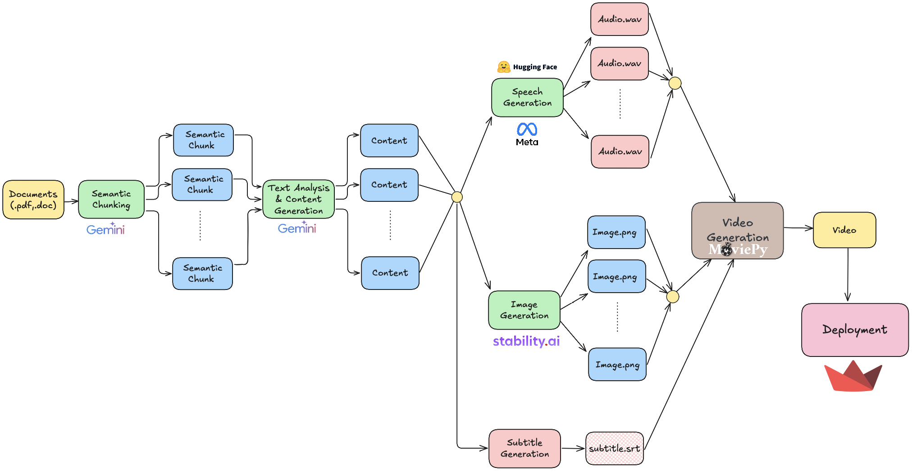

# KnowFlow - Chuyển Bài Giảng Thành Video

KnowFlow là một ứng dụng giúp chuyển đổi file bài giảng (PDF, DOCX) thành video có giọng đọc và hình ảnh minh họa. Dự án sử dụng các công nghệ AI hiện đại để phân tích nội dung, sinh lời giảng, tạo ảnh và dựng video tự động.

## 🚀 Tính năng chính
- **Semantic Chunking & Text Analysis**: Sử dụng `gemini-pro` của Google để chia nhỏ văn bản và tạo lời giảng tự động.
- **Text-to-Speech (TTS)**: Sử dụng `mms-tts-vie` của Facebook để tạo giọng đọc tiếng Việt tự nhiên.
- **Image Generation**: Sử dụng `stable-diffusion-3.5-large` của Stability AI để tạo hình ảnh minh họa.
- **Video Generation**: Sử dụng `moviepy` để tạo video từ giọng đọc và hình ảnh.
- **Triển khai dễ dàng**: Chạy trên `Streamlit` với giao diện đơn giản, hỗ trợ tải file và xem video đầu ra.

## 🛠️ Công nghệ sử dụng
- **Google Gemini-Pro** - Semantic chunking & text generation
- **Facebook MMS-TTS-VIE** - Chuyển văn bản thành giọng nói
- **Stability AI Stable Diffusion 3.5 Large** - Tạo hình ảnh minh họa
- **MoviePy** - Dựng video từ giọng đọc và hình ảnh
- **Streamlit** - Giao diện web để tải file và xem kết quả

## 📥 Cài đặt
Yêu cầu Python 3.8+ và pip.

```bash
# Clone repo
git clone https://github.com/hieunguyen-cyber/knowflow.git
cd knowflow

# Cài đặt các thư viện cần thiết
pip install -r requirements.txt
```

## ▶️ Chạy ứng dụng
```bash
streamlit run app.py
```
Sau khi chạy lệnh trên, mở trình duyệt và truy cập `http://localhost:8501` để sử dụng.

## 📸 Hình ảnh minh họa


## 📜 Giấy phép
Dự án được phát hành dưới giấy phép MIT.

---
_Tác giả: Nguyễn Trung Hiếu_
